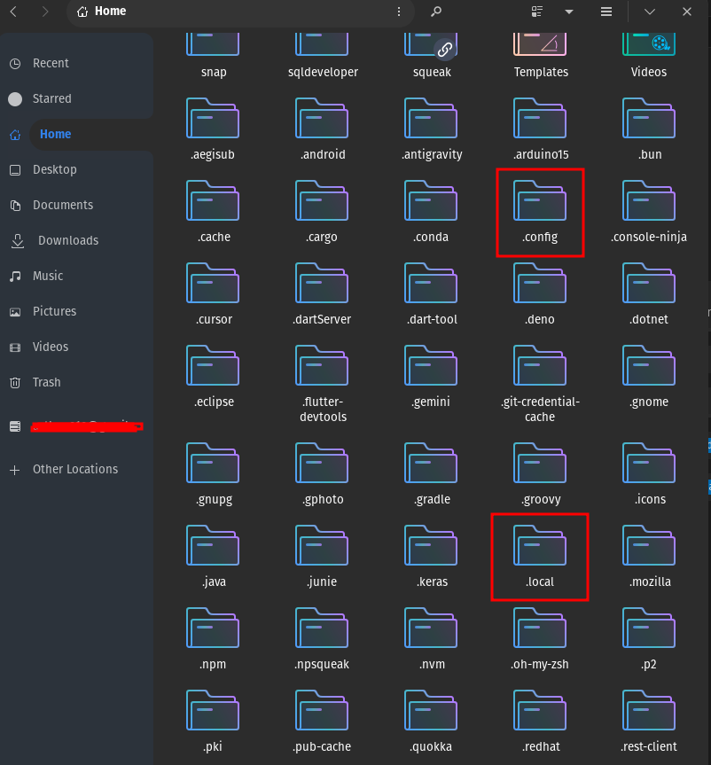
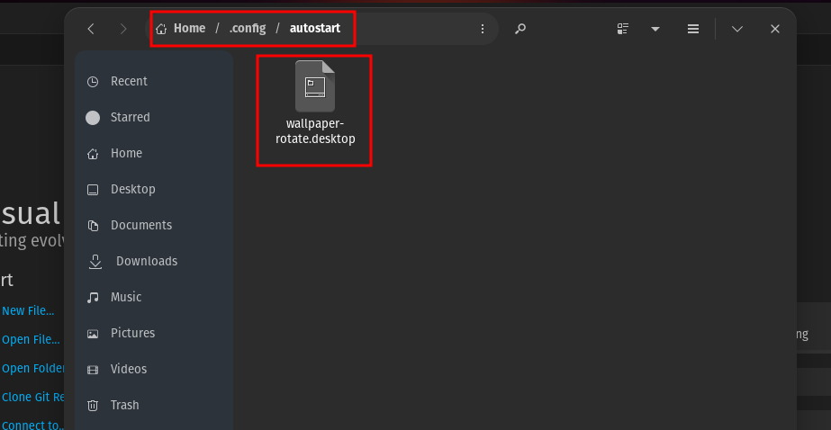
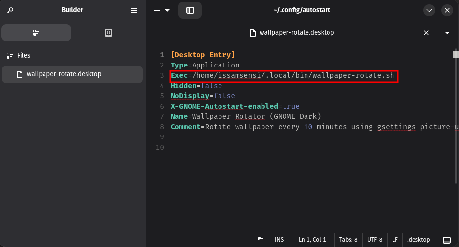
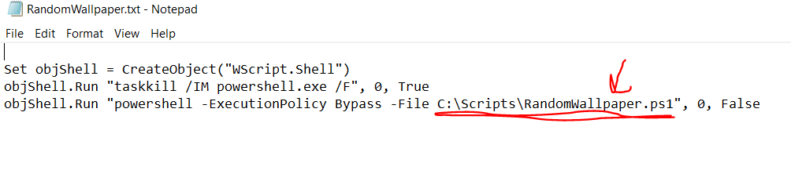
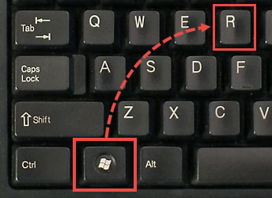
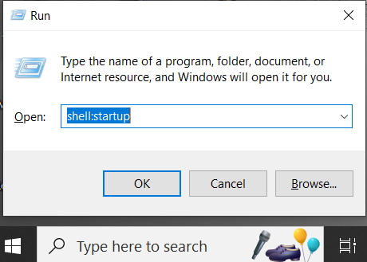
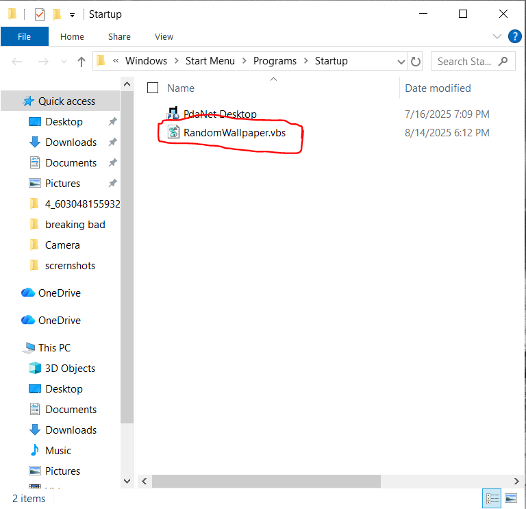

# 🎨 AutoWallpaper

> Keep your desktop fresh with automatic wallpaper rotation—because staring at the same background all day is so yesterday.

## 📖 Description

**AutoWallpaper** is a lightweight, cross-platform solution that automatically rotates your desktop wallpaper at custom intervals. Whether you're on Linux (GNOME) or Windows, this tool keeps your workspace visually interesting without consuming precious system resources. Set it up once, and let your desktop surprise you throughout the day!

## ✨ Features

- 🔄 **Automatic Rotation** – Changes wallpaper at your preferred interval (e.g., every 10 minutes, hourly)
- 🪶 **Lightweight** – Minimal resource usage (low CPU, RAM, and battery impact)
- 🖼️ **180+ Wallpapers Included** – Curated collection ready to use out of the box
- 🐧 **Linux Support** – Works seamlessly on GNOME desktop environments
- 🪟 **Windows Support** – Simple PowerShell-based solution for Windows users
- 🚀 **Runs on Startup** – Automatically starts when you boot your system

## 🚀 Installation

### For Linux (GNOME)

1. **Place the script file** in a local directory (e.g., `~/.local/bin/`):
   ```bash
   mkdir -p ~/.local/bin
   cp Linux-Gnome/wallpaper-rotate.sh ~/.local/bin/
   chmod +x ~/.local/bin/wallpaper-rotate.sh
   ```
   
   
   
   *Tip: Press `Ctrl + H` to view hidden files and folders.*

2. **Configure the wallpaper folder** by editing the script:
   ```bash
   nano ~/.local/bin/wallpaper-rotate.sh
   ```
   Update the `folder` variable to point to your wallpaper directory (default: `$HOME/Pictures/wallpapers`):
   ```bash
   folder="$HOME/Pictures/wallpapers"
   ```

3. **Set up autostart** by placing the desktop file in the autostart directory:
   ```bash
   cp Linux-Gnome/wallpaper-rotate.desktop ~/.config/autostart/
   ```
   
   

4. **Update the desktop file** to match your script location:
   ```bash
   nano ~/.config/autostart/wallpaper-rotate.desktop
   ```
   Change the `Exec` line to your script path:
   ```
   Exec=/home/YOUR_USERNAME/.local/bin/wallpaper-rotate.sh
   ```
   
   

5. **Restart your session** or run the script manually to start:
   ```bash
   ~/.local/bin/wallpaper-rotate.sh &
   ```

### For Windows

1. **Place the PowerShell script** in a directory of your choice (e.g., `C:\Scripts\`):
   ```powershell
   mkdir C:\Scripts
   # Copy RandomWallpaper.ps1 to C:\Scripts\
   ```

2. **Configure the wallpaper folder** by editing `RandomWallpaper.ps1`:
   - Open the file in a text editor
   - Update the `$wallpaperFolder` variable to point to your wallpaper directory:
     ```powershell
     $wallpaperFolder = "C:\Users\YOUR_USERNAME\Pictures\wallpapers"
     ```

3. **Configure the VBS launcher**:
   - Right-click `RandomWallpaper.vbs` and open with Notepad
   - Update the script path to match your PowerShell script location:
     ```vb
     objShell.Run "powershell -ExecutionPolicy Bypass -File C:\Scripts\RandomWallpaper.ps1", 0, False
     ```
   
   

4. **Add to startup**:
   - Press `Win + R` to open the Run dialog
   
   
   
   - Type `shell:startup` and press Enter
   
   
   
   - Copy the VBS file into the startup folder
   
   

5. **Restart your computer** or double-click the VBS file to start immediately

## 🎯 Usage

Once installed, AutoWallpaper runs automatically in the background. No manual intervention needed!

### How It Works

**Linux (GNOME):**
- The script randomly selects an image from your wallpaper folder
- Sets it as both light and dark mode wallpaper using `gsettings`
- Waits for the specified interval, then repeats

**Windows:**
- The PowerShell script randomly picks an image from your wallpaper folder
- Uses Windows API to set it as the desktop background
- The VBS launcher runs PowerShell silently in the background (no console window)

### Customizing the Rotation Interval

Edit the interval value in the respective script:

**Linux** (`wallpaper-rotate.sh`):
```bash
interval=600  # Change this value
```

**Windows** (`RandomWallpaper.ps1`):
```powershell
Start-Sleep -Seconds 600  # Change this value
```

**Common intervals:**
- **600 seconds** = 10 minutes (default)
- **1800 seconds** = 30 minutes
- **3600 seconds** = 1 hour
- **7200 seconds** = 2 hours

### Using Your Own Wallpapers

The project includes 180+ wallpapers in the `assets/wallpapers/` directory. To use your own:

1. Create or use an existing wallpaper folder
2. Add your images in supported formats (JPG, JPEG, PNG, BMP)
3. Update the folder path in the script (see Installation instructions above)
4. The script automatically picks random images from all files in that folder

## 📸 Screenshots

Check out the `assets/screenshots/` directory for visual guides on setup and configuration.

## 🛠️ Technologies Used

- **Bash** – Linux shell scripting with infinite loop for continuous wallpaper rotation
- **gsettings** – GNOME configuration system for setting wallpapers (light & dark mode)
- **PowerShell** – Windows automation with .NET interop for system calls
- **VBScript** – Silent launcher to run PowerShell without showing console window
- **Windows API** – `SystemParametersInfo` for native wallpaper management

## 🤝 Contributing

Contributions are welcome! Here are some ideas to get started:

- 🐧 Add support for other Linux desktop environments (KDE, XFCE, etc.)
- 📱 Explore mobile platform support
- 🎨 Create a GUI for easier configuration
- 🖼️ Add image preview/selection functionality
- 🌐 Implement online wallpaper sources

To contribute:
1. Fork this repository
2. Create a feature branch (`git checkout -b feature/amazing-feature`)
3. Commit your changes (`git commit -m 'Add some amazing feature'`)
4. Push to the branch (`git push origin feature/amazing-feature`)
5. Open a Pull Request

## 📄 License

This project is open source and available under the [MIT License](LICENSE).

---

<div align="center">

**If you find this project useful, give it a ⭐ and share it with your friends!**

Made with ❤️ for desktop enthusiasts everywhere

</div>