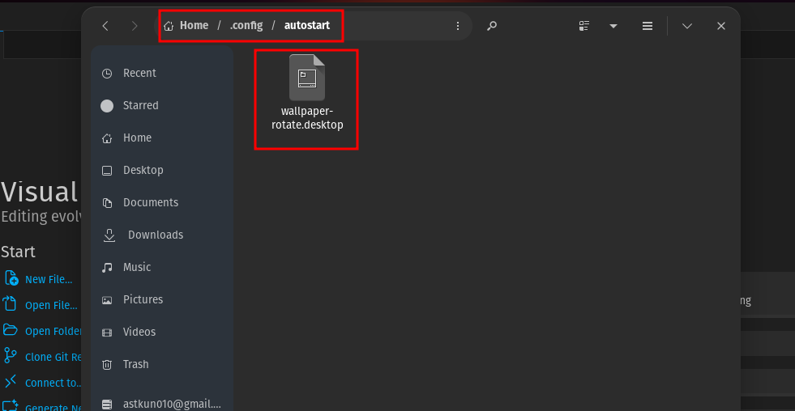

hello this is the auto wallpaper changer

LINUX

first thing put the script file in a directory like .local

you can visible all the files by clicking the ctrl + h

and put the desktop file in autostart in .config like this

and cahange the the url of this to the script path like this

also change the wallpaper path in the script
this script works just in gnome

WINDOWS
for the windows
